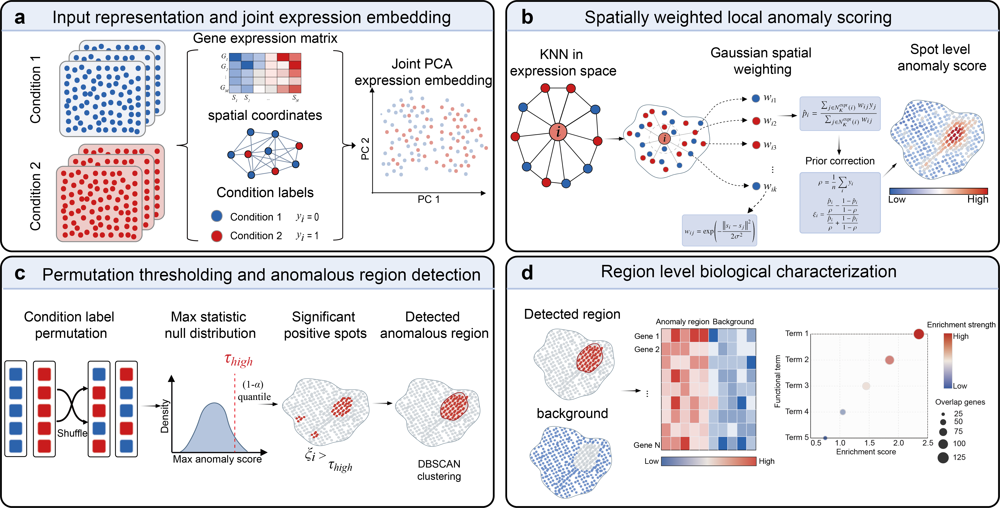

# AReST

**AReST v1.0.0**

AReST is a spatially weighted neighborhood contrast framework for detecting anomalous regions in comparative spatial transcriptomics data.

Comparative spatial transcriptomics is often used to ask not only which genes change between biological conditions, but also where condition related molecular changes appear within tissue. AReST addresses this problem by estimating spot level anomaly evidence from transcriptional neighborhoods, incorporating spatial proximity, correcting for the global condition prior, and converting positive anomaly evidence into spatially coherent anomalous regions.

## Framework



## Overview

AReST takes as input:

- a gene expression matrix,
- spatial coordinates,
- condition labels.

The workflow consists of four main steps:

1. Construct transcriptional neighborhoods in expression space.
2. Compute a spatially weighted local condition enrichment score.
3. Derive an upper threshold using label permutation.
4. Apply DBSCAN to significant anomalous spots to obtain anomalous regions.

The detected regions can then be used for downstream biological interpretation, including marker analysis, region level enrichment, and comparison with anatomical or literature supported reference regions.

## Repository organization

This repository is organized into three main parts:

- `data/`, which contains processed data used in the manuscript, including real spatial transcriptomics data and simulation related files.
- `notebooks/`, which contains reproduction notebooks and helper code for running AReST analyses.
- `results/`, which contains reproduced outputs, including anomaly scores, detected regions, metric summaries, and representative figures.


## Git LFS

The processed `.h5ad` file is stored with Git LFS. Please clone the repository with Git LFS enabled before running notebooks that require large processed files:

```bash
git clone https://github.com/liuyk669/AReST.git
cd AReST
git lfs pull
```

The compressed simulation matrices are stored directly in git and do not require Git LFS.

## Requirements

```text
anndata>=0.10
scanpy>=1.10
numpy>=1.26
pandas>=2.0
scipy>=1.10
scikit-learn>=1.4
scikit-misc>=0.3
matplotlib>=3.8
jupyter>=1.0
```

## Version

Current version: **AReST v1.0.0**

## License

AReST is released under the MIT License.
